# ☕ Coffee Bean Defect Detection

A simple web application that can look at photos of coffee beans and tell you which ones are good or bad!

---

## 🎯 What Does This Do?

Upload a photo of coffee beans → Get results showing:
- ✅ **Good beans** (marked with green boxes)
- ❌ **Bad beans** (marked with red boxes)
- 📊 **Count of each type**

### Types of Coffee Bean Problems We Can Find:
- **Normal** - Perfect beans ✅
- **Black** - Beans that turned black ❌
- **Broken** - Cracked or split beans ❌
- **Damaged** - Beans with holes or damage ❌
- **Immature** - Beans that weren't ready for harvest ❌

---

## 📁 What's Inside This Project?

```
coffee-bean-defect-detection/
│
├── backend/                   # The "brain" of the app
│   ├── __pycache__/          # Python cache files
│   ├── logs/                 # App activity records
│   ├── runs/                 # Training history
│   ├── uploads/              # Where uploaded photos are stored
│   ├── best.pt               # The AI model that recognizes beans
│   ├── detect.py             # Code that analyzes the beans
│   ├── loguru_config.py      # Logging setup
│   ├── main.py               # Main server file
│   ├── requirements.txt      # List of Python tools needed
│   └── utils.py              # Helper functions
│
├── frontend/                  # The website you see
│   ├── node_modules/         # Website tools (auto-generated)
│   ├── public/               # Static files
│   │   └── vite.svg         # Website icon
│   ├── src/                  # Website code
│   │   ├── assets/          # Images and files
│   │   ├── components/      # Reusable website parts
│   │   ├── App.css          # Website styling
│   │   ├── App.jsx          # Main website component
│   │   ├── index.css        # Global styling
│   │   └── main.jsx         # Website entry point
│   ├── .gitignore           # Files to ignore in git
│   ├── eslint.config.js     # Code quality rules
│   ├── index.html           # The main webpage
│   ├── package-lock.json    # Exact versions of tools
│   ├── package.json         # List of website tools needed
│   ├── postcss.config.js    # CSS processing config
│   └── vite.config.js       # Build tool configuration
│
└── README.md                 # This file!
```

---

## 🔄 Project Workflow

```mermaid
flowchart TD
    A[👤 User Opens Website] --> B[📁 Select Coffee Bean Image]
    B --> C{🔍 Valid Image?}
    C -->|❌ No| D[⚠️ Show Error Message]
    C -->|✅ Yes| E[📤 Upload to Backend]
    
    E --> F[💾 Save to uploads/ folder]
    F --> G[🧠 Load YOLOv11 Model]
    G --> H[🔬 AI Analyzes Image]
    
    H --> I[🎯 Detect Each Bean]
    I --> J[🏷️ Classify Bean Type]
    J --> K{ More Beans?}
    K -->|✅ Yes| I
    K -->|❌ No| L[ Count All Classifications]
    
    L --> M[🎨 Draw Bounding Boxes]
    M --> N[📈 Generate Statistics]
    N --> O[💾 Log Results]
    
    O --> P[📱 Send Results to Frontend]
    P --> Q[🖼️ Display Annotated Image]
    Q --> R[📊 Show Bean Counts]
    R --> S[✅ Analysis Complete!]
    
    D --> T[🔄 Try Again?]
    T -->|✅ Yes| B
    T -->|❌ No| U[👋 End Session]
    
    S --> V[🔄 Analyze Another Image?]
    V -->|✅ Yes| B
    V -->|❌ No| U
    
    style A fill:#e1f5fe
    style S fill:#c8e6c9
    style U fill:#ffcdd2
    style H fill:#fff3e0
    style G fill:#f3e5f5
```



### 🎯 What Each Step Does:

**🌐 Frontend Steps:**
- **User Interface**: Upload, display results, handle errors
- **Validation**: Check file size and format before sending

**⚙️ Backend Steps:**
- **File Handling**: Save uploaded images securely
- **AI Processing**: Run YOLOv11 model on the image
- **Data Processing**: Count beans, generate statistics

**🧠 AI Model Steps:**
- **Detection**: Find all beans in the image
- **Classification**: Identify each bean as Normal/Black/Broken/Damaged/Immature
- **Annotation**: Draw colored boxes around each detected bean

**📊 Output Steps:**
- **Results**: Send back annotated image and statistics
- **Logging**: Record all activity for monitoring

---

## 🚀 How to Run This on Your Computer

### What You Need First:
- **Python** (version 3.9 or newer) - [Download here](https://python.org)
- **Node.js** (version 18 or newer) - [Download here](https://nodejs.org)

### Step 1: Download This Project
```bash
# Download the project
git clone https://github.com/aditiprasadrao/coffee-bean-defect-detection.git

# Go into the project folder
cd coffee-bean-defect-detection
```

### Step 2: Start the Backend (The Brain) 
```bash
# Go to the backend folder
cd backend

# Install the tools needed
pip install -r requirements.txt

# Start the server
uvicorn main:app --reload
```
✅ You should see: `Application startup complete` - this means it's working!

### Step 3: Start the Frontend (The Website) 
Open a **new terminal window** and run:
```bash
# Go to the frontend folder (from the main project folder)
cd frontend

# Install website tools
npm install

# Start the website
npm run dev
```
✅ You should see a web address like: `http://localhost:5173`

### Step 4: Use the App! 🎉
1. Open your web browser
2. Go to `http://localhost:5173`
3. Upload a photo of coffee beans
4. Click "Analyze"
5. See the results!

---

## 📖 How to Use

1. **Take or find a photo** of coffee beans (JPG, PNG formats work)
2. **Drag and drop** the photo onto the website, or click to browse for it
3. **Click "Analyze"** button
4. **Wait a few seconds** for the magic to happen
5. **See your results**:
   - Photo with colored boxes around each bean
   - Numbers showing how many good vs bad beans were found

### Example Result:
```
📊 Results:
• Good beans: 15
• Broken beans: 3
• Damaged beans: 1
• Black beans: 0
• Immature beans: 2

Total beans found: 21
```

---

## 🔧 Technology Used (Don't Worry About This!)

**Backend (The Smart Part):**
- Python - Programming language
- FastAPI - Makes the server work
- YOLOv11 - AI that recognizes beans

**Frontend (The Pretty Part):**
- React - Makes interactive websites
- Tailwind CSS - Makes it look nice
- Vite - Builds the website

---

## ❓ Troubleshooting

### Problem: "Command not found" errors
**Solution:** Make sure Python and Node.js are installed correctly

### Problem: Website won't load
**Solution:** 
1. Check both backend and frontend are running
2. Backend should show: `Uvicorn running on http://127.0.0.1:8000`
3. Frontend should show: `Local: http://localhost:5173`

### Problem: "Model not found" error
**Solution:** Make sure `best.pt` file is in the `backend` folder

### Problem: Upload not working
**Solution:** Try smaller image files (under 10MB), use JPG or PNG format

---

## 🤝 Want to Help Make This Better?

Found a bug? Have an idea? Here's how to help:

1. **Report problems**: Tell us what went wrong
2. **Suggest improvements**: Share your ideas
3. **Share photos**: Send us coffee bean photos to test with

---

<div align="center">

</div>
